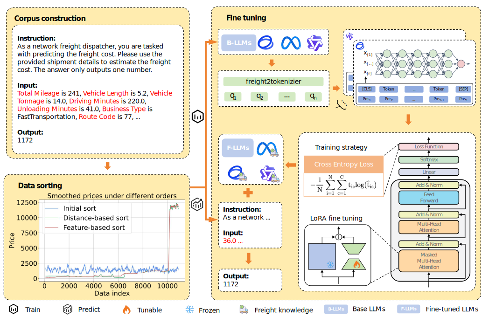

# Introduction
This repository is the reporisity of **LogisticsLLM: Network Freight Price Prediction Based on Large Language Models**. 
This paper introduces Large Language Models (LLMs) to predict network freight prices by using prior knowledge inherent in the
LLMs.

# OverView



# Data Process

python data_process.py --mode=SI --dataset=MC --order_strategy=InitOrd --sequence=NamedFeatSeq --split=82

python data_process.py --mode=SI --dataset=HE --order_strategy=SeqeOrd --sequence=NamedFeatSeq --split=82


# Train

CUDA_VISIBLE_DEVICES=0 llamafactory-cli train config/MC_Scale100_Split82_InitOrd_ValueOnlySeq_Cot0_GLM4-9b-chat_Epochs5_En.yaml


# Batch train

python generate_cross_parameter_yaml.py

python generate_bash_script.py

nohup ./scripts/train.sh > logs/output.log 2>&1 &


# Terminate batch training
pkill -f train.sh


# Predict

python llm_logistics.py --dataset=MC --model=GLM4-9b-chat --epoch=5 --mode=test --loss_fun=cross --split=82 --order_strategy=InitOrd --sequence=NamedFeatSeq --cot=0 --scale=100

python llm_logistics.py --dataset=HE --model_name=GLM4-9b-chat --epoch=15 --loss_fun=cross --mode=test --split=82 --order_strategy=InitOrd --sequence=ValueOnly --cot=0 --scale=100


# Batch Predict

nohup ./scripts/predict.sh > logs/output.log 2>&1 &


# Abbreviation
#### running mode
+ BA (batch)
+ SI (single)

#### dataset
+ MC (MathCup)
+ HE (HackerEarth)

#### Train data sorting strategies
+ InitOrd (init)
+ SeqeOrd (feature)
+ DistOrd (distance)

#### Input sequence
+ NamedFeatSeq (FeatureName: FeatureValue, FeatureName: FeatureValue)
+ ValueOnlySeq (FeatureValue FeatureValue)
+ ListTempSeq  (FeatureName: FeatureValue\n FeatureName: FeatureValue)
+ JsonSeq  ("FeatureName": "FeatureValue", "FeatureName": "FeatureValue")

#### Model
+ GLM4-9b-chat
+ Qwen2-7B-Instruct
+ Llama-3.1-8B-Instruct

#### Epochs
+ Epochs5
+ Epochs10

# Naming rule
+ checkpoints:  checkpoints/HE_Split82_DistOrd_ListTempSeq_Cot0_GLM4-9b-chat_Epochs5_En
+ train_file:   HE_Split82_DistOrd_ListTempSeq_Cot0_En_train.json
+ test_file:    HE_Split82_DistOrd_ListTempSeq_Cot0_En_test.json
+ result_file:  MC_Split82_DistOrd_NamedFeatSeq_Cot0_GLM4-9b-chat_Epochs3_En_20240820.csv


# Project Structure
The repo structure and module functions are as follows:
```text
project_name/
│
├── config/                                                 // training paramer file
│   ├── HE_Scale100_Split82_DistOrd_JsonSeq_Cot0_llama-3-8b-instruct_Epochs15_En.yaml
│   ├── MC_Scale100_Split82_InitOrd_ValueOnlySeq_Cot0_llama-3-8b-instruct_Epochs5_En.yaml
│   └── MC_Scale100_Split82_SeqeOrd_JsonSeq_Cot0_Qwen2.5-7B-Instruct_Epochs5_En.yaml
│
├── data/
│   ├── raw/
│   ├── processed_llm/
│   └── processed_tabular/
│
├── checkpoints/                                             // training checkpoints file
│   └── cross_entropy/
│
├── environments/                                            // environments file
│
├── base_models/                                             // LLMs base file
│
├── src/
│   ├── compare_base_model/
│   ├── common.py
│   ├── compare_model.py
│   ├── compare_test.py
│   ├── data_base_hacker_earth.py
│   ├── data_base_hacker_earth_onehot.py
│   ├── data_base_interface.py
│   ├── data_base_mathor_cup.py
│   ├── data_base_mathor_cup_onehot.py
│   ├── data_process.py
│   ├── generate_bash_script.py
│   ├── generate_cross_parameter_yaml.py
│   ├── llm_cross.py
│   ├── llm_response_analyser.py
│   └── llm_utils.py
│
├── templates/                                               // training template file
│
├── scripts/                                                 // batch scripts file
│   ├── predict.sh
│   └── train.sh
│
├── results/                                                 // test result file
│   └── metrics/
│
├── logs/
├── requirements.txt
└── llm_logistics.py                                         // main file
```
